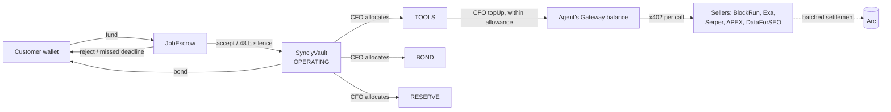

# Syncly

**AI agents do the work. An AI CFO runs the money.** Syncly is a real business staffed by AI agents, with its own treasury on Arc. Small businesses hire the agents for paid work from 1 USDC a job. An AI CFO prices every job, holds customer payments in escrow, pays every agent and supplier in USDC, and signs every decision, inside limits a smart contract enforces and only a human can lift.

**Live on Arc mainnet:** [hiresyncly.site](https://hiresyncly.site) · [follow the money](https://hiresyncly.site/#money) · [the CFO's signed log](https://hiresyncly.site/api/cfo) · [the office, live](https://hiresyncly.site/live) · [traction](TRACTION.md) ([live copy](https://hiresyncly.site/api/traction.md))

Built for the [Tameion Agents Hackathon](https://tameion.thecanteenapp.com) (Canteen × Circle), Sep 27 – Oct 10, 2026. Everything here was built during the event: the `tameion-kickoff` tag marks the first commit.

## What it does, in the hackathon's terms

Tameion asks for AI agents that manage a business's money: the treasury, invoices, contractors, autonomous operations, and the audit trail behind all of it. Syncly is that business, and its customers' payments are the money being managed.

| The brief | In Syncly | Code |
|---|---|---|
| **Treasury** | SynclyVault holds the company's USDC in five buckets: operating, tools, bond, reserve and promo. Every 10 minutes (and within a minute of new money landing) the CFO reads the vault, plans the week, re-plans mid-week when an agent runs dry, puts revenue to work and keeps the reserve above its floor. The owner funds the team by sending USDC to the vault; nobody splits money by hand. | [`SynclyVault.sol`](contracts/src/SynclyVault.sol), [`treasury.ts`](server/src/cfo/treasury.ts) |
| **AP / AR** | *Syncly's own:* every order is a fixed-price bill paid into JobEscrow, released only when the customer accepts; the agents' tool bills are paid per call with x402 and settled on Arc. *A customer business's:* [Syncly Pay](https://hiresyncly.site/pay) books its invoices and supplier bills on InvoiceBook (paid once, straight to the booked payee), chases what it's owed, pays approved suppliers by itself from the business's own PayVault account, and emails it a CFO's report every Monday. | [`JobEscrow.sol`](contracts/src/JobEscrow.sol), [`InvoiceBook.sol`](contracts/src/InvoiceBook.sol), [`PayVault.sol`](contracts/src/PayVault.sol), [`pay.ts`](server/src/pay.ts), [`x402.ts`](server/src/x402.ts) |
| **Contractor & vendor network** | The ten agents are contractors: each has its own wallet, a weekly allowance set from what it really spends per job, and top-ups from the CFO. Their vendors' payout addresses are pinned per service; a Pay business's suppliers are pinned after the first payment, and a changed address is stopped. | [`treasury.ts`](server/src/cfo/treasury.ts), [`payees.json`](server/src/payees.json), [`pay.ts`](server/src/pay.ts) |
| **Autonomous operator** | The CFO acts alone, inside limits contracts enforce: at most 2 USDC per vault move, a 3 USDC weekly tool budget, and for a Pay business only its approved suppliers under its own per-bill and weekly caps. Anything beyond is an on-chain proposal a human approves from their wallet. No language model touches the money. | [`SynclyVault.sol`](contracts/src/SynclyVault.sol), [`PayVault.sol`](contracts/src/PayVault.sol), [`quote.ts`](server/src/cfo/quote.ts) |
| **Compliance intelligence** | Every address we or a Pay business deal with (suppliers, payers, tool vendors) is re-screened daily against Circle's USDC blacklist, and watched one hop out: the other side of every USDC transfer they make on Arc is screened too. A hit stops payments or holds autopay for a person. | [`screen.ts`](server/src/screen.ts), [`payees.ts`](server/src/payees.ts) |
| **Audit trail** | Every CFO decision is hash-chained to the one before and signed by its key, and the hash rides in the vault transaction's `reason` field. Every payment links to its Arc transaction; each escrow and invoice seals the hash of its document. | [`log.ts`](server/src/cfo/log.ts), [/api/cfo](https://hiresyncly.site/api/cfo) |

## Syncly Pay: the agents run a business's own payments

Syncly's CFO doesn't only run Syncly's money. [**Syncly Pay**](https://hiresyncly.site/pay) runs a customer business's invoices (money in) and supplier bills (money out):

- **Invoices.** The business types *"Ada, 2 party trays at ₦25,000 each, due Friday"*; the Writer turns it into an invoice, the CFO books it on Arc, and the Messenger emails a pay link and chases it. The customer pays straight to the business's address (a Bybit Arc deposit address works, so it can be cashed out to naira).
- **Bills.** The business uploads a photo of a supplier's invoice; the Analyst reads it, and the Investigator checks the payee before anything is booked: Circle's USDC blacklist, **a payout address that changed since the last bill** (the classic invoice fraud), duplicates, unusual amounts. The business approves, then pays from its wallet.
- **[`InvoiceBook.sol`](contracts/src/InvoiceBook.sol)** fixes each invoice's payee, exact amount and document hash when it's booked, then lets it be paid once, straight from payer to payee: no wrong payee, no double pay, no phantom invoice, no rounding. Only the CFO's key can book, after the business confirms its email. 0.5% per paid invoice goes to SynclyVault. 14 tests.
- **Autopay, inside the owner's limits.** The business puts USDC in its own [`PayVault`](contracts/src/PayVault.sol) account and sets the rules from its wallet: which suppliers, the most per bill, the most per week. The CFO pays approved suppliers' bills on their due dates by itself; the contract re-checks every rule on every payment. Outside them it can only propose on-chain, and the owner approves from their wallet. Only the owner can withdraw. 12 tests.
- **Screening, daily and one hop out.** Suppliers, payers and the business's own address are re-checked every day against Circle's USDC blacklist, and the other side of every USDC transfer they make on Arc is screened too. A hit stops payment or holds autopay.
- **A CFO's report every Monday:** the week's money in and out, overdue invoices, a 7-day cash forecast, whether autopay covers next week's bills (and how much to add), and what's waiting for the owner.

## Try it (for judges)

1. **Follow the money** on the home page ([/#money](https://hiresyncly.site/#money)): each stop has a live number from the running company.
2. **Read the CFO's log** at [/api/cfo](https://hiresyncly.site/api/cfo): the vault's buckets, each agent's balance and allowance, this week's plan, and every decision with what the CFO saw, signed and hash-chained. `verify.ok` means every hash and signature checks out.
3. **Order a website** at [/hire/website](https://hiresyncly.site/hire/website) (2 USDC, paid into escrow on Arc). The job page shows the team working live and **the money on this job**: the CFO's quote and bond, the escrow, every tool the agents bought with its Arc settlement, and the release or refund.
4. **Check a receipt.** Job #1 ([ord_mulrvp33_0603](https://hiresyncly.site/job/ord_mulrvp33_0603)) found 9 restaurants with 5 x402 payments, each linked to its settlement on Arc ([0xb76f18…](https://explorer.arc.io/tx/0xb76f1819087eea9c3bbd9886384a44556450a6fa831a1575818165fa0355fe25), [0xc99ba1…](https://explorer.arc.io/tx/0xc99ba105332d26b54c73cc1ba1677e299c9dc632eb3f835e50309a40d41d4fbd)).
5. **Pay for a job** (needs about 2.05 USDC on Arc in a browser wallet). The page walks through the steps: connect the wallet, the CFO opens the escrow, then approve and fund. On the job page you then accept, revise or reject from the same wallet.
6. **Watch the office** at [/live](https://hiresyncly.site/live). The agents act out real events: the CFO stamps the quote and walks the brief to the whiteboard, and the Messenger carries the delivery out.
7. **Run a business's payments** at [/pay](https://hiresyncly.site/pay): send an invoice from one sentence, confirm by email, then on your desk upload a supplier's bill, set up autopay with your own limits, and read the CFO's weekly report.

## How the money moves



## The CFO: what it decides, and what it can't do

Every 10 minutes, and soon after any job is accepted, delivered or refunded, the CFO ([`server/src/cfo/treasury.ts`](server/src/cfo/treasury.ts)):

1. **Reads** the vault's five buckets, each agent's Gateway balance, and the past week's spend per agent per job, measured from receipts.
2. **Plans the week.** Each agent's allowance is its measured spend per job times the jobs expected, scaled to fit the vault's weekly tool budget. The plan's hash is sealed on-chain (`openEpoch`) before any money moves.
3. **Puts revenue to work**, in order: TOOLS for the week's remaining allowances, then BOND up to 3 USDC of cover, then RESERVE up to its floor. The rest stays in OPERATING.
4. **Tops up** any agent that can afford fewer than two of its usual jobs, or less than one job of the most expensive service it works on, within its allowance. Readiness for every service is planned first each week; the Books page shows which services the team is funded for.
5. **Re-plans mid-week** when an agent has used its whole allowance and is running low: more from the week's unplanned budget, then from allowance fully stocked agents won't need. The vault's `setAllowance` still enforces the weekly budget, so a re-plan can't overspend the week.
6. **Escalates** when it can't act: TOOLS is empty, its gas is low, or a move exceeds what it may do alone.
7. **Writes every decision down**: what it saw, the rule that fired, the amount and the transaction.

New money in the vault is acted on within a minute. The owner funds the team by sending USDC to the vault (the **Fund the team** box on the books page), and the CFO credits it, moves what the week needs into TOOLS and tops the agents up.

It also prices every job ([`server/src/cfo/quote.ts`](server/src/cfo/quote.ts)). The cost comes from the median measured cost. p(accept) comes from a Beta(4,1) prior updated with the service's acceptance history. The bond is 10–30% of the price, higher when confidence is higher, and capped by what the BOND bucket can cover. Every service is priced at 1 or 2 USDC on purpose (traction over profit), so the CFO takes a job unless it is expected to lose more than 2 USDC. Every number is on the quote, which only the owner sees in full.

**Limits it cannot talk its way past** (enforced by [`SynclyVault.sol`](contracts/src/SynclyVault.sol), not by a prompt):

- The CFO key can only move money between the vault's buckets, top up registered agents' Gateway balances within their allowance, and pay approved human reviewers. There is no function that sends vault money anywhere else.
- It moves at most 2 USDC (`maxMove`) in one step. Anything bigger has to be a `propose`, which only the Boss can `coSign`. The CFO's own policy also caps itself at `maxMove` per bucket pair per week; past that it moves what it may and proposes the rest for the Boss to co-sign. The Boss changes these limits on-chain from the Books page.
- Weekly allowances can't exceed the 3 USDC tool budget. The reserve can't go under its floor. Bonds outstanding must always be covered.
- **No language model touches money.** Pricing, allocation and top-ups are computed. The Auditor model only flags the work, and the customer's wallet is the only thing that releases a payment.

**The decision log** ([`server/src/cfo/log.ts`](server/src/cfo/log.ts)) is append-only. Each entry is hash-chained to the one before and signed by the CFO's key, and the vault transaction's `reason` field carries the hash of the decision. Anyone can replay the log from [/api/cfo](https://hiresyncly.site/api/cfo); `verify.ok` means every hash and signature checks out.

## Controls against the failure modes in "Agents and Ledgers in 2026"

Canteen's [essay](https://thecanteenapp.com/analysis/2026/09/12/agents-and-ledgers.html) lists the errors an AI can make that still balance the books. Here is how Syncly handles each:

| Failure | Control in Syncly |
|---|---|
| Paying the wrong party (commission) | Each seller's payout address is pinned per service in [`payees.json`](server/src/payees.json), which is reviewed in git. A changed payee is refused before anything is signed and logged for review. The escrow's payee is fixed when it opens. For a Pay business, see below. |
| Paying twice after a timeout | If a call fails after the payment was signed, the seller may already have taken it, so it is not retried. It is retried only when the seller says it declined. Tested in [`scripts/pay-safety.ts`](server/scripts/pay-safety.ts). |
| Recording a payment that never happened | A receipt is written only after a paid call succeeds, and each is linked to the Arc settlement transaction Circle Gateway produced: a record from outside our own books. |
| Rounding 6 decimals down to 2 | The ledger keeps 6 decimals and refuses an unbalanced entry. There is no silent round-off account. |
| Releasing money on a model's confidence | The customer's wallet accepts or rejects. The CFO's rules are deterministic, and models only produce the work and check it. |
| An entry with no document behind it | Every ledger line points to its job. Each escrow seals the hash of the agreed terms (`specHash`) and of the delivery (`deliverableHash`) on-chain, so terms, delivery and payment can be matched. |

**Paying the wrong party, answered in layers.** The essay's hardest case is the one the chain can't catch: it confirms you paid exactly whom you chose. So Syncly makes choosing the wrong payee hard at every step, each enforced somewhere an agent can't argue with:

1. **A human approves the first payment** to any supplier. After that its address is pinned to it.
2. **A changed payout address is a stop**, not a warning: the owner must say they called the supplier on a number they already had. ("New bank details" is the classic invoice fraud.)
3. **The payee is fixed on-chain when the invoice is booked** (InvoiceBook), so an edited link or a forged message can't redirect the money.
4. **The agent can only autopay addresses the owner approved** from their own wallet (PayVault), under the owner's caps.
5. **Every address is re-screened daily and one hop out**, so a supplier that turns bad after the first payment is caught before the next one.

**Why beancount:** the ledger is written in [beancount](https://github.com/beancount/beancount) format, kept in the owner's private books. Precision is declared in the entry itself, not hidden in a column type, and a human can read what the agent wrote.

## On Arc mainnet (chain 5042)

| Contract / wallet | Address | Role |
|---|---|---|
| **SynclyVault** | [`0x589e8ec9134777acecb83a9abdf018942ddc9f2b`](https://explorer.arc.io/address/0x589e8ec9134777acecb83a9abdf018942ddc9f2b) | The treasury: five buckets (OPERATING, TOOLS, BOND, RESERVE, PROMO). The CFO can move money between buckets and fund agents, never send it anywhere else. |
| **JobEscrow** | [`0xde2ca0c975a1f5789f9b79fe578d43ccf417edbd`](https://explorer.arc.io/address/0xde2ca0c975a1f5789f9b79fe578d43ccf417edbd) | Paid jobs. The customer funds it, and only the customer can accept or reject. Silence for 48 h releases the payment, and a missed deadline refunds it plus the bond. |
| **InvoiceBook** | [`0x7b0530865040dc44a9cc90270396d7c5bcac8f93`](https://explorer.arc.io/address/0x7b0530865040dc44a9cc90270396d7c5bcac8f93) | Syncly Pay. Each business invoice's payee, exact amount and document hash are fixed when the CFO books it; it is paid once, straight from payer to payee, with 0.5% to the vault. |
| **PayVault** | [`0x2d9f8eb4bb30f89a92c5acbee68223ee572f3641`](https://explorer.arc.io/address/0x2d9f8eb4bb30f89a92c5acbee68223ee572f3641) | Syncly Pay autopay. Each business's own account: the CFO can pay only suppliers its owner approved, under the owner's per-bill and weekly caps, and only booked invoices. Anything else it can only propose; only the owner's wallet withdraws or changes the rules. |
| Boss | [`0xe7aa82bd4659b5af2b16d0af5dcab42fe8089b40`](https://explorer.arc.io/address/0xe7aa82bd4659b5af2b16d0af5dcab42fe8089b40) | The vault's owner: a human's wallet, outside the server's keys. Co-signs anything above the CFO's limits. |
| CFO | [`0xB95dd6425d19BF09d206dc780a758e1C2EF4f1a9`](https://explorer.arc.io/address/0xB95dd6425d19BF09d206dc780a758e1C2EF4f1a9) | The vault's CFO key and the escrow's operator. It signs the decision log. |
| Treasury | [`0x102AdC546dAE682B7cDD9aB6d624822fdD3DC209`](https://explorer.arc.io/address/0x102AdC546dAE682B7cDD9aB6d624822fdD3DC209) | Deployed the contracts. Funded the first agents' Gateway balances before the vault existed. |
| USDC | `0x3600000000000000000000000000000000000000` | Arc's native USDC (gas and settlement) |
| Circle GatewayWallet | `0x77777777Dcc4d5A8B6E418Fd04D8997ef11000eE` | Holds each agent's balance for x402 payments; the vault tops agents up here |

Agent wallets, each registered in the vault and paying for its own tools:

| Agent | Address | Buys |
|---|---|---|
| Scout | [`0xF57E…7256`](https://explorer.arc.io/address/0xF57E85630d0D100cCD2AEf7f6956aa2975B27256) | Search (Exa, Serper Maps) |
| Researcher | [`0x02aA…d3eb`](https://explorer.arc.io/address/0x02aA3749c7af3181C85Eee4CBa999747E449d3eb) | AI models (BlockRun) to plan and extract |
| Reader | [`0x594E…54Cf`](https://explorer.arc.io/address/0x594EC11A38d68a8c2A365C941d8d76eEe9e954Cf) | Page reading (Exa contents, APEX) |
| Writer | [`0x16a4…2B28`](https://explorer.arc.io/address/0x16a4f6FCfAb3B607df1965A443Aa8819fed52B28) | AI models (BlockRun) |
| Investigator | [`0x7E0C…BCB0`](https://explorer.arc.io/address/0x7E0C1c33FcE6605630c473d4a44255f26463BCB0) | Email, phone and seller checks (APEX, Twilio via BlockRun, Didit), and AI-assistant answers (DataForSEO) |
| Designer | [`0x00aF…DAF4`](https://explorer.arc.io/address/0x00aFF88Ae2B22f67cf87Ca74d36d37f7BA6fDAF4) | Claude Opus 5 for websites, and images (BlockRun) |
| Producer | [`0x37c8…9f36`](https://explorer.arc.io/address/0x37c8de9f9740Ed30bcdCc1ea5B8C08567BE19f36) | Claude Opus 5 for motion ads, video and music (BlockRun) |
| Analyst | [`0x2E51…c958`](https://explorer.arc.io/address/0x2E516E71912adA3B7aFa989aCE06D9A51e7fc958) | AI models to compare prices, answers and signals (BlockRun) |
| Auditor | [`0x72e5…c9b6`](https://explorer.arc.io/address/0x72e514Afed2EFdecA263d9710068259f4B00c9b6) | A second AI model family, to check the work |
| Messenger | [`0x37D0…95a9`](https://explorer.arc.io/address/0x37D0ccDfcC37ba1803002d95D0077828Afcd95a9) | Email delivery (Resend; AgentMail by x402 as a fallback) |

Key transactions: [vault deployed](https://explorer.arc.io/tx/0x77d94e018c642a803962f9031367098fed1a4c2eadac34f1d5dab14d03c8d6ff), [escrow deployed](https://explorer.arc.io/tx/0xa6066e70dd18c60cd41cbe29fbc0a33af7f3564a1f196221cd79c31a8acf4b26), [ownership handed to the Boss](https://explorer.arc.io/tx/0x4020c9a206135485c11e3386d488b1e10790077af525a73dc58ff82afc4ec5ab), [the CFO's first weekly plan sealed on-chain](https://explorer.arc.io/tx/0x8af07f69b1c058e51379bbab8c31f3f419a110fd5dc2174988a566dfb4f158d4). Every address and deploy transaction is in [`deployments/arc.json`](deployments/arc.json).

## Where the money comes from: the work the agents sell

Real money has to flow for the CFO to manage it, so Syncly sells work small businesses already pay freelancers for. A business fills in a short form about itself and the job (*"party trays for 20 guests, ₦25,000, orders on WhatsApp, ₦5,000 a day for ads"*), the CFO prices it, the agents do it, and the customer decides whether to pay.

| Service | Price | What you get |
|---|---|---|
| Website | 2 USDC | A designed site from the Google listing, Instagram and the owner's photos, hosted at a link the same day, plus the files. It wires in where the business already sells (Chowdeck, with its menu and ₦ prices read from the store, Glovo, Heyfood, Paystack, Flutterwave, Selar, Bumpa, Fresha, Calendly, Tix and more) and a pay-by-transfer card, and the owner gets a private editor to change prices, hours, links and photos themselves, post an announcement with dates, and make QR posters whose scans are counted |
| Content Pack | 2 USDC | The content styles working in the niche this week (backed by real posts and their numbers), then 7 posts and 3 images |
| Ad Launch | 2 USDC | 3 ad angles from ads that have run 30+ days, feed and Story creatives, an 8 s video, copy, and a 7-day plan for the budget; diagnoses the ads they already ran |
| Motion Ad | 1 USDC | A 12–24 s motion video with an original soundtrack, rendered on our own server |
| Product Photo Studio | 2 USDC | Phone photos turned into studio, lifestyle and white-background shots, each checked against the original so the product doesn't change |
| Get Found | 2 USDC | Google Maps rank street by street against competitors, profile gaps, what ChatGPT, Gemini, Claude and Perplexity say, a fix list, a profile description and review replies |
| Buy Smart | 2 USDC | The cheapest trustworthy offers, delivered, and a red/amber/green check on the sellers before paying |
| Local Business Finder | 1 USDC | Every business of a type in an area, with phone, website and rating, as a spreadsheet |
| Lead List | 1 USDC | Up to 25 verified business emails, each with a personalised first line |
| Research Brief | 1 USDC | Competitors, market and pricing, with every claim cited |

The menu comes from research into what small businesses already pay agencies and freelancers for, and what a search or a chatbot can't do: jobs that need fresh data from many paid sources at once, checking against the truth, or real production.

- **Every job is paid into escrow on Arc** from the customer's own wallet. (Free first websites ran during launch week; the CFO's promo bucket still covers them in the books, and `FREE_FIRST_WEBSITE=1` switches them back on.)
- **Nothing is paid unless the customer accepts.** Only the paying wallet can accept, ask for one free revision, or reject. A rejection refunds the price plus a bond the CFO put up.
- **The agents buy their own tools.** Each has its own wallet and pays per call (x402 nanopayments through Circle Gateway) for AI models, search, page reading and email checks. Every call is listed on the customer's job page, linked to the Arc transaction that settled it. Costs and margins stay in the owner's private books.
- **The CFO runs the money.** It plans each agent's weekly budget, puts revenue to work, and tops up agents that run low. Anything above its limits goes to a human to co-sign on-chain.

## Circle tools used

- **Circle Gateway (x402 batching):** every agent pays sellers per call from its own Gateway balance, via [`@circle-fin/x402-batching`](https://www.npmjs.com/package/@circle-fin/x402-batching). The vault funds agents by calling `GatewayWallet.depositFor`, and settlement transactions are read back with `getTransferById`.
- **USDC on Arc:** customer payments, escrow, bonds, the vault, and gas (Arc pays gas in USDC).
- **Circle App Kit (CCTP + swaps):** [Get USDC on Arc](https://hiresyncly.site/arc), also opened from every checkout, brings a customer's USDC from Base, Ethereum, Arbitrum and other chains over CCTP Fast with Circle's forwarder minting on Arc (no Arc gas needed), or swaps ETH or USDT into USDC on Arc, from the customer's own wallet ([`BringMoney.tsx`](web/src/components/BringMoney.tsx)).
- **Circle Onramp Kit (Arc Onramp):** customers in the US, UK and EU can buy USDC on Arc with Apple Pay, Google Pay, a debit card or a bank transfer, inside the same panel. The server mints a short-lived session locked to the customer's wallet and to USDC on Arc; the API key never reaches the browser. Switched on by `ONRAMP_API_KEY`.
- **Smart contracts on Arc:** SynclyVault and JobEscrow, and InvoiceBook and PayVault (Syncly Pay), written in Foundry with 42 tests.
- **x402 discovery:** sellers were chosen from Circle's x402 discovery API for Arc (2,133 paid endpoints on 30 Sep 2026), and `scripts/preflight.ts` checks each one's payment terms without paying.
- **Two ways to pay a seller:** Gateway-batched payments from an agent's Gateway balance, and direct EIP-3009 USDC transfers from the agent's own wallet for sellers that only take those (Claude Opus 5 on BlockRun's Arc endpoint), through `@x402/core` with the batch scheme and an exact-scheme fallback. Async sellers (video) are polled with the same signed payment and settle only when the result is ready. `scripts/pay-safety.ts` tests both paths against a fake seller.

## Repo map

| Path | What |
|---|---|
| [`server/`](server) | The company: API (Hono, Node 24 running TypeScript directly), services, x402 payments, the CFO, escrow, the ledger |
| [`server/assets/reel/`](server/assets/reel) | The motion engine behind Motion Ad: one-shape morph reels with springs, a cursor and a synthesised score, rendered frame by frame in headless Chrome |
| [`web/`](web) | The site (Next.js 16): hire, job pages, books, the CFO's desk, the office (PixiJS) with a marimba soundtrack |
| [`contracts/`](contracts) | SynclyVault, JobEscrow, InvoiceBook and PayVault, with tests (Foundry) |
| [`deployments/`](deployments) | Mainnet addresses and deploy transactions |
| [`assets/`](assets) | The cast (generated with Higgsfield), sliced sprites and the office scene; [`STYLE.md`](assets/STYLE.md) logs every generation credit |
| [`proto/`](proto) | The day-1 office prototype |

## Run it

```bash
cd server && npm ci && OUTLAY_DRY=1 PORT=8790 node src/api.ts   # demo mode: no money moves, labelled everywhere
cd web && npm ci && npm run dev                                    # http://localhost:5174
```

Tests:

```bash
cd contracts && forge test                                   # 30 contract tests
cd server && node scripts/pay-safety.ts                      # no double pay, payee pinning (fake local seller)
anvil --port 8645 &                                          # local chain with a mock USDC at Arc's address
LOCAL_RPC=http://127.0.0.1:8645 node scripts/escrow-local.ts # deploy contracts, fund a bond pool
# then run the API with OUTLAY_DRY=1 OUTLAY_ESCROW_NET=local OUTLAY_CFO=live and:
node scripts/escrow-e2e.ts http://localhost:8790 accept      # also: reject | expire | auto | fail
```

Live mode needs the agents' mnemonic (`OUTLAY_MNEMONIC`) and `deployments/arc.json`. `ONRAMP_API_KEY` (a live key from the Circle console) switches on card and bank purchases. `OUTLAY_CFO=live` lets the CFO act; the default `observe` makes it log what it would do.

## Honest status

- **Live since Sep 28:** the first job was delivered and accepted, with every tool payment settled on Arc. Escrow and the CFO went live on Sep 29. Outside customers are the next step; [TRACTION.md](TRACTION.md) is generated from the live books and never includes demo data.
- **Not used, and why:**
  - **USYC:** it needs an allowlist, and mainnet has a $100k minimum.
  - **Paymaster:** it isn't deployed on Arc.
- **Email delivery** goes out from hello@hiresyncly.site through Resend. The Messenger can also pay AgentMail per email by x402 (`OUTLAY_MAIL=aisa`).
- **Paying customers need a wallet with USDC on Arc.** /arc brings it from another chain, swaps it from ETH or USDT, or lists the exchanges that withdraw to Arc.
